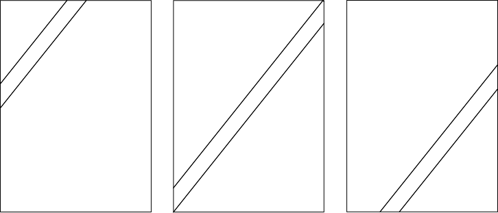
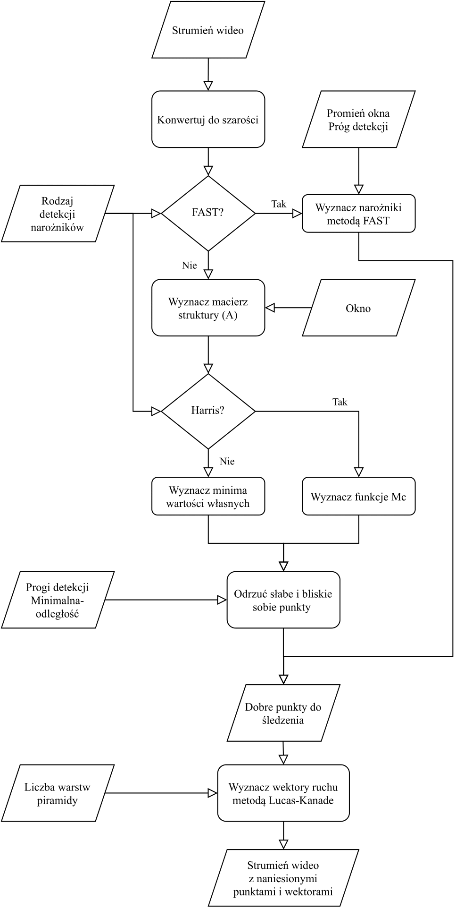

===================================================================================
Specyfikacja Algorytmiczna
===================================================================================

:Autor: Jacek Ambroży Dobrowolski
:Data:   18 Grudzień 2020

.. role:: raw-latex(raw)
   :format: latex
..

Funkcjonalność
===============

-  Wykrywanie dobrych punktów do śledzenia w obrazie

-  Odnajdowanie przesunięcia śledzonych narożników

Dane wejściowe
===============

-  Nagranie wideo

-  Parametry wybierane z poziomu aplikacji

Dane wyjściowe
===============

-  Strumień wideo z naniesionymi punktami i ich wektorami ruchu

-  Podgląd działania poszczególnych etapów przetwarzania

Narzędzia
==========

-  Python

-  NumPy

-  OpenCV

Wykrywanie dobrych punktów do śledzenia w obrazie
-------------------------------------------------

Do wykrywania narożników w obrazie można wykorzystać różne metody.
Najbardziej popularne są Harrisa-Stephens:raw-latex:`\cite{Harris}` i
Shi-Tomasi:raw-latex:`\cite{Shi-Tomasi}`, są one do siebie podobnę i
część algorytmu jest wspólna. Obie metody zakładają że narożnik to punkt
obrazu w którym intensywność zmienia się w więcej niż dwóch kierunkach.
Zmiana w jednym kierunku oznacza krawędź. Niech :math:`I(x, y)` równa
się intensywności pixela o koordynatach x i y. :math:`I(x + u, y + v)`
równa się intensywności pixela odległego o u i v od poprzedniego.
Narożnik znajdzie się się więc w punkcie gdzie suma kwadratów różnic
między tymi wartościami będzie największa. Co można zapisać jako

.. math:: S(x,y) = \Sigma_{u}\Sigma_{v}w(u, v)[I(x + u, y + v) - I(x, y)]^2

gdzie :math:`w(u, v)` to funkcja okna przesuwanego po obrazie,
zwracająca wartość jeden dla małego obszaru i zero dla reszty. Obszarem
do zbadania jest działanie innych okien okrągłych, niebinarnych. To
równanie możemy przybliżyć wielomianem korzystając z twierdzenia
Taylora. Niech :math:`I_x` i :math:`I_y` będą pochodnymi :math:`I` tak
aby :math:`I(x + u, y + v) \approx I(u, v) + I_x(u, v)x + I_y(u, v)y`
Daje to wielomian

.. math:: S(x, y) \approx \Sigma_u \Sigma_v w(u, v)(I_x(u, v)x+I_y(u,v)y)^2

Zapisane w formie macierzowej:

.. math::

   S(x, y) \approx 
           \begin{pmatrix}
               x & y 
           \end{pmatrix}
           \mathbf{A} 
           \begin{pmatrix}
               x \\
               y \\
           \end{pmatrix}

.. math::

   {\displaystyle 
       A=\sum _{u}\sum _{v}w(u,v){
           \begin{bmatrix}
               I_{x}(u,v)^{2}&I_{x}(u,v)I_{y}(u,v)\\
               I_{x}(u,v)I_{y}(u,v)&I_{y}(u,v)^{2}
           \end{bmatrix}}={
           \begin{bmatrix}
               \langle I_{x}^{2}\rangle &\langle I_{x}I_{y}\rangle \\
               \langle I_{x}I_{y}\rangle &\langle I_{y}^{2}\rangle 
           \end{bmatrix}}
       }

Poprzez analizę wartości własnych macierzy :math:`\mathbf{A}` można
znaleźć narożniki.

-  Obie wartości są bliskie zeru dany pixel nie ma dobrych punktów do
   śledzenia

-  Jedna z wartości własnych jest bliska zeru a druga ma duża wartość
   dany pixel znajduje się na krawędzi

-  Obie wartości własne mają duże dodatnie wartości dany pixel jest
   narożnikiem

W tym punkcie metody zaczynają się różnić.

Harris-Stephens
~~~~~~~~~~~~~~~

Jako że wyznaczanie wartości własnych macierzy jest złożone
obliczeniowo. Dlatego stosuje funkcje :math:`M_c`

.. math::

   M_c = \lambda_1 \lambda_2 - \kappa \, (\lambda_1 + \lambda_2)^2
               = \operatorname{det}(A) - \kappa \, \operatorname{trace}^2(A)

Gdzie :math:`\kappa` to stała wyznaczana empirycznie, która odpowiada sa
czułość algorytmu. W literaturze można się spotkać z wartościami między
:math:`0.04` do :math:`0.15`.

Shi-Tomasi
~~~~~~~~~~

Metoda Shi-Tomasi bezpośrednio wyznacza :math:`min(\lambda_1, lambda_2)`
Co daje nieco lesze wyniki kosztem złożoności obliczeniowej.

Metoda FAST
~~~~~~~~~~~

Metoda FAST (Features from accelerated segment
test):raw-latex:`\cite{FAST}` polega na znalezieniu punktów dla których
w danym promieniu. Znaczna część pixeli różni się od centralnego pixela
o wartość progu detekcji. Zaletą tej metody jest niska złożoność
obliczeniowa. Algorytm ten ma 3 parametry które można zbadać.

Estymacja przesunięcia śledzonych narożników
--------------------------------------------

Metoda Lucas-Kanade:raw-latex:`\cite{Lucas-Kanade}` jest szeroko
stosowana w wizji komputerowej. Polega na założeniu że ruch w sąsiednich
pixeli przebiega w jednym kierunku. Jako metoda o działaniu lokalnym nie
radzi sobie z wyznaczaniem ruchu dla regionów o jednakowej
intensywności. Dlatego jako dane wejściowe podajemy dobre punkty do
śledzenia. Metoda ta zakłada również nie wielki ruch między
poszczególnymi klatkami. Wynikają z tego pewne ograniczenia takie jak
słabe działanie dla szybkich obiektów lub konieczność szybszego
próbkowania obrazu. Algorytm wyznacza wektor który najlepiej opisuje
ruch danego wycinka obrazu.

.. math::

   \begin{matrix}
               I_{x}(q_{1})V_{x}+I_{y}(q_{1})V_{y}=-I_{t}(q_{1}) \\
               I_{x}(q_{2})V_{x}+I_{y}(q_{2})V_{y}=-I_{t}(q_{2}) \\
               \vdots  \\ 
               I_{x}(q_{n})V_{x}+I_{y}(q_{n})V_{y}=-I_{t}(q_{n}) \\
           \end{matrix}

Gdzie :math:`V_x` to współrzędna pozioma wektora ruchu regionu a
:math:`V_y` to współrzędna pionowa tegoż wektora.
:math:`q_1, q_2, \dots q_n` to pixele wewnątrz regionu. A
:math:`I_{x}(q_{i}),I_{y}(q_{i}),I_{t}(q_{i})` to pochodne cząstkowe
intensywności obrazu. Równanie to można zapisać w formie macierzowej
jako. :math:`\mathbf{A}v=b` gdzie:

.. math::

   {\displaystyle 
           \mathbf{A}={
           \begin{bmatrix}
               I_{x}(q_{1})&I_{y}(q_{1})\\
               I_{x}(q_{2})&I_{y}(q_{2})\\
               \vdots &\vdots \\
               I_{x}(q_{n})&I_{y}(q_{n})
           \end{bmatrix}}
           \quad \quad \quad 
           v={
           \begin{bmatrix}
               V_{x}\\
               V_{y}
           \end{bmatrix}
           }\quad \quad \quad 
           b={
           \begin{bmatrix}
               -I_{t}(q_{1})\\
               -I_{t}(q_{2})\\
               \vdots \\
               -I_{t}(q_{n})
           \end{bmatrix}}}

Jest to zwykle układ nadokreślony metoda Lucas-Kanade przybliża wynik
metodą najmniejszych kwadratów.

.. math:: {\mathrm  {v}}=(\mathbf{A^{T}}\mathbf{A})^{{-1}}\mathbf{A^{T}}b

Problem przesłony
~~~~~~~~~~~~~~~~~

Metoda Lucas Kanade jest podatna na problem przesłony jest to zjawisko
kiedy określenie kierunku ruchu nie jest możliwe na podstawie jego
drobnego wycinka. Efekt jest zobrazowany na poniższej ilustracji.

   *Ilustracja obrazująca efekt przysłony*

Piramidy i iteracje
~~~~~~~~~~~~~~~~~~~

W literaturze można spotkać się z określeniem piramid. Jest to porostu
metoda poprawienia działania algorytmu Lucas-Kanade poprzez obliczanie
wektora najpierw dla obniżonej rozdzielczości. A następnie dla coraz
większej. Ma to na celu zmniejszenie szumu i losowości w miejscach gdzie
wyznaczenie przesunięcia nie jest możliwe. Można spodziewać się
poprawienia trafności algorytmu stosując piramidy.

Badanie działania algorytmów
----------------------------

Najprostszą miarą badającą złożoność obliczeniową są uzyskane klatki na
sekundę. Wadą takiego pomiaru jest duży wpływ implementacji. Inne miary
jakich planuje użyć sa empiryczne. Istnieją specjalne zestawy danych
rzeczywistych i syntetycznych, jednak porównanie działania algorytmów na
nich zostało już wykonane.

Dalszy rozwój projektu
----------------------

Projekt może zostać rozbudowany o prostą stabilizacje obrazu. Opartą na
wygładzaniu ruchu kamery poprzez odkształcanie obrazu.

      
   *Diagram algorytmu*